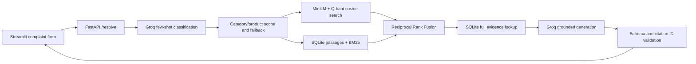

# Telecom Support Resolution Assistant

A query-only support-agent prototype: few-shot complaint classification, metadata-scoped
semantic/BM25 retrieval, rank fusion, and evidence-grounded resolution drafting with citations.
Synthetic tickets and a text-based PDF knowledge base provide the evidence.

## Architecture



## Run on Windows

From the project root, with `.venv` activated:

```powershell
python -m pip install -r requirements.txt
python scripts/prepare_classification_examples.py
python -m pytest tests -q
python -m uvicorn telecom_support.api:app --app-dir src --host 127.0.0.1 --port 8000
```

The API requires an existing active index from `scripts/build_index.py`, enriched KB
records from `scripts/classify_kb.py`, and a local `.env` containing `GROQ_API_KEY`
and optionally `GROQ_MODEL` (default `openai/gpt-oss-20b`). Do not commit `.env`.
Restart the API after changing the active build, examples, or taxonomy.

In a second terminal, activate the same environment and run:

```powershell
python -m streamlit run app.py --server.address 127.0.0.1
```

Open http://localhost:8501. API readiness: http://127.0.0.1:8000/health.
Interactive API documentation: http://127.0.0.1:8000/docs.
Ctrl+C stops each service. Use one API worker; embedded Qdrant owns its local storage lock.

## Behavior and limits

- Classification examples are selected only from training tickets; evaluation tickets
  are excluded. The prototype is scoped to ten telecom support categories and four products.
  Severity uses Low/Medium/High and sentiment uses Neutral/Frustrated/Angry.
  Examples demonstrate single-label categories; multiple labels are instructed but not yet evaluated.
- Semantic and lexical search run independently in the same metadata scope for tickets
  and KB. General KB records with both label lists empty remain searchable.
- Scope broadens from category/product to product-only to global when fewer than three
  distinct sources are available or no semantic candidates pass the threshold.
- `SEMANTIC_THRESHOLD` is a process environment variable (default 0.30). It is experimental,
  not calibrated confidence. Cosine threshold does not apply to BM25. Keyword-only evidence
  can still be returned and is flagged in search diagnostics.
- Fusion combines rankings; a cross-encoder reranker is not implemented yet.
- Each normal resolution makes two Groq calls. If no evidence exists, generation is skipped.
  No automatic retry occurs. A 429 reports retry-after when available. Check free-tier quota
  before repeated demos. Selecting examples, embedding and local tests make no Groq calls.
- Each step must cite an evidence ID. Validation checks IDs and structure, not whether every
  claim is entailed by a passage. Agents must review the draft. UI exposes exact retrieved text.
- Complaints exceeding MiniLM's input limit are rejected with a shortening instruction.
- Embeddings use historical conversation text, which includes agent fixes, and original KB text.
- This is a local prototype: no authentication, cross-encoder, Docker deployment or production
  monitoring yet. PDF replacement reuses unchanged vectors in fresh snapshots; label registration
  is agent-controlled rather than automatic class discovery. RAG evaluation tooling requires reviewed
  references and live results before quality claims can be made.
  Bind to localhost; do not expose publicly without completing those controls.
- Generated records, model caches, databases and examples are under ignored `data/indexes/`.
  The SQLite `sources.record_json` column holds full records. Qdrant point IDs match SQL passage IDs.

## Tests

`python -m pytest tests -q` uses temporary records and simulated LLM calls; it verifies
contracts, holdout exclusion, source links, scope fallback, ranking, and citation IDs.
Live model prediction quality is a separate evaluation milestone.

## Classification evaluation

The evaluator reuses the production classifier and training-only examples; it does not
change prompts or run retrieval/generation. Start with a small mechanics check:

```powershell
python scripts/evaluate_classification.py --limit 5 --delay 30
```

Then evaluate all held-out tickets, reusing saved successful predictions:

```powershell
python scripts/evaluate_classification.py --delay 30
```

Each uncached ticket uses one Groq request. Telecom categories are round-robin ordered
for useful small samples. On a provider failure the
run stops after saving the failure and prior successes; rerun later to retry unfinished
tickets. Thirty seconds is pacing, not a guarantee against token/day limits. Avoid running
interactive Groq queries concurrently during the evaluation.

Outputs are under `data/indexes/evaluations/classification/classification-<model>-<version>/`:
`manifest.json` records model/prompt/examples/taxonomy/data identity; `predictions.jsonl`
records attempts and reference/predicted labels; `report.json` records metrics and mistakes.
Changed inputs automatically create a different run directory. The report is overwritten
for the requested selection; removing `--limit` expands its scope. Saved attempts remain.

Metrics: exact-match accuracy for category/product, severity/sentiment accuracy,
category macro F1, all-fields accuracy, request counts/success
rate, and average successful-call latency. Failed calls are excluded from label metrics but explicitly
included in request health and selected-ticket coverage. Values are fractions (0–1);
null means no denominator. These are agreements with synthetic reference labels, not
proof of real-world correctness. With only four held-out cases per category, results
are preliminary. A five-case check is not a final benchmark.

To recalculate a full report from saved results without sending API requests:

```powershell
python scripts/evaluate_classification.py --report-only
```

Dataset revision `telecom-only-evaluation-v1` replaces the 20 unrelated held-out cases
with two additional synthetic telecom cases per category. All 160 reference tickets and
the other 20 evaluation tickets are retained: 200 tickets total, 40 held out, four per category.
Replacement text and labels are recorded in `dataset_creation/telecom_evaluation_replacements.json`.
The three workbooks and affected source notes/counts are kept consistent. The old five-case
report is a historical baseline for a different scope; its scores must not be compared
directly with this revised dataset. Existing severity/sentiment disagreements are not
resolved by removing out-of-scope cases. Label review remains necessary.

Current revision `covered-telecom-problems-v2` supersedes those test rows. All 40 held-out
complaints are synthetic paraphrases of problems supported by specified training-ticket
procedures, with four cases per category. They are not an independent unseen-problem
benchmark. Training complaints and procedures remain unchanged; Critical maps to High,
clear historical anger maps to Angry, other expressed dissatisfaction/distress maps to
Frustrated, and factual uncertainty or urgency maps to Neutral. Test complaints explicitly
express their intended tone; the former positive examples now express strong anger.
Labels describe tone separately from fault severity. The scenario specification and source
links are in `dataset_creation/covered_evaluation_scenarios.json`. All prior evaluation
outputs were archived outside the repository. Temporary migration artifacts and obsolete
snapshots are also outside the project; active data and current evaluation reports are retained.
New results must be generated; old scores are not comparable with this revised benchmark.

## RAG quality evaluation

The optional evaluator uses Ragas 0.2.15's ContextPrecision, ContextRecall, Faithfulness,
AnswerRelevancy and AnswerCorrectness. These judge semantic meaning, not identical wording.
Citation validity is a local ID check; citation support is a separate per-step Groq judgment
against only the cited evidence. No combined quality score is invented.

Install the optional dependencies (the application does not require Ragas):

```powershell
python -m pip install --no-cache-dir -r requirements-evaluation.txt
python scripts/prepare_rag_evaluation.py
```

`data/evaluation/rag_reference_cases.jsonl` is a committed, editable reference dataset,
separate from the retrieval index and few-shot examples. Each row contains a complaint,
reference resolution, original ticket version, review status and notes. References initially
copy Excel resolution steps and summaries with `review_status: "draft"`. Check whether
steps rely on later-discovered facts; edit the reference to reflect appropriate diagnostic
actions and accepted alternatives. Only then set that row to `"reviewed"`. Re-preparation
preserves existing references, and refuses to silently overwrite changed underlying tickets.
For the covered-problem revision, preparation validates each declared training source and
checks that its procedure is included in the reference steps. These cases use
`review_status: "source_checked"` and omit historical final-outcome summaries from the
expected answer. This denotes a source-consistency check, not human approval. Corrective
actions remain conditional on confirming the relevant condition and authorisation.
They can be evaluated without `--allow-draft`; the report still discloses their synthetic scope.

For a one-case exploratory mechanics check with unreviewed references:

```powershell
python scripts/evaluate_rag.py --stage answers --limit 1 --delay 30 --allow-draft
python scripts/evaluate_rag.py --stage scores --limit 1 --delay 30 --allow-draft
```

Stop the backend first with Ctrl+C in its terminal: local Qdrant storage cannot be opened
by the evaluator and API process simultaneously. No running interface is needed.
The answers stage runs the actual classification/retrieval/generation pipeline. The scores
stage reuses saved answers and calls the Groq judge through Ragas. All generation/judge
requests, including internal subrequests, are serialized and spaced by the delay. Scoring
may take substantially longer than answer generation. Each successful metric is saved,
then reused when the same command is rerun. Provider failures stop the run; no automatic
provider retry is configured. Ragas may issue paced output-repair requests for malformed JSON.
There is no OpenAI API or hosted embedding call: embeddings use the existing local MiniLM.
Ragas telemetry and LangSmith tracing are disabled by the entry script.

After reviewing references, omit `--allow-draft`; omit `--limit` for all references:

```powershell
python scripts/evaluate_rag.py --stage answers --delay 30
python scripts/evaluate_rag.py --stage scores --delay 30
python scripts/evaluate_rag.py --stage report
```

Readable folders under `data/indexes/evaluations/rag/rag-evaluation-<model>-<version>/`
contain `manifest.json`, `assistant_answers.jsonl`, `rag_metric_scores.jsonl` and `report.json`.
Changing references, index, examples, models, threshold or evaluator code creates a separate
compatible run. A short version suffix disambiguates runs; it is not a metric or ranking.
The report uses descriptive metric names, score coverage, error lists, average and 95th
percentile latency, and pipeline request success rate. Pipeline latency excludes startup,
intentional request delays and judging time. The raw pipeline timing breakdown includes
the evaluation pacer's wait; use the evaluator's `latency_seconds` for runtime comparisons.

Context precision judges ranked evidence usefulness against the reference. Context recall
checks coverage of reference statements. Faithfulness checks answer claims against the exact
evidence fields provided to generation, including historical resolution steps. Answer relevance
uses reconstructed questions and local embedding similarity. Answer correctness combines
statement-level agreement with reference/answer embedding similarity using Ragas defaults.
Embedding-dependent scores use MiniLM. The evaluation adapter splits long text into
bounded nonoverlapping parts, computes a token-count-weighted average of their vectors,
and normalizes the result. Short-text embeddings retain their existing behavior. The
LLM judge receives the complete answer/reference, and retrieval embedding limits remain
unchanged. Pooling is an explicit local embedding configuration, not a replacement for
Ragas metric formulas or a guarantee of semantic accuracy. These
are model-dependent estimates; inspect examples and judge disagreement rather than claiming
human-verified quality. References from synthetic Excel data may be incomplete or ambiguous.
Empty-evidence precision/recall/faithfulness and step-less citation scores are marked undefined,
with insufficient-evidence cases counted separately. Missing/failed scores are never silently
converted to zero or excluded without exposing scored-case counts.
# Adding new knowledge through the interface

## Replacing an existing PDF

Choose **Add knowledge → New PDF → Replace existing PDF**, select an indexed document,
then upload its updated version. Logical `document_id` is preserved across versions;
each version's uploaded bytes remain archived under its ingestion job. The raw original
PDF is not overwritten. The selector uses filenames (or titles for older uploads).

An identical file hash is a no-op. Otherwise extraction/chunking runs again and SHA-256
content hashes compare chunks across the selected document, not by chunk number. New
chunks persist `content_hash` in SQLite's record JSON. Unchanged text reuses compatible
metadata (same taxonomy, prompt and LLM model) and existing MiniLM vectors. Changed/new
passage texts are embedded; their metadata is classified as needed. Text matching is
exact, so line-wrap/whitespace or boundary changes can require new work. Page numbers,
version and source references are refreshed even for unchanged text.

Only the selected document's old chunks are omitted from the new active snapshot. All
other documents/tickets remain. SQLite and Qdrant are written to a fresh verified
snapshot, reusing persisted vectors by exact text and compatible embedding model.
This saves embedding computation but still copies retained vectors into the new store;
it is not an in-place Qdrant patch. The previous snapshot remains available on failure.
Old snapshots remain on disk for recovery and are not queried by the active backend.

The API lists documents through `GET /ingestion/documents`. Replacement uses the existing
binary PDF endpoint with query parameters `replacement_id=<document_id>` and `filename`.
Job results record `unchanged_chunks`, `changed_or_new_chunks`, `removed_chunks`,
`embedded_unique_texts` and `reused_passages`. Removed chunks count old texts no longer
present, including old versions of edited text. Completed jobs replay in creation order
on command-line rebuilds, so prepared originals cannot silently replace newer versions.
Replacing a PDF uses the current taxonomy; register new labels with a separate upload.

## PDFs introducing a new category or product

Under **Add knowledge → New PDF**, choose **Existing categories** for the standard
upload, or **New category or product** to extend the label registry. Supply a category,
product, or both. A new name requires a short description. Names are checked against
existing labels without case sensitivity; existing definitions are never overwritten.

If one label is blank, Groq suggests a directly supported match from the existing list
using bounded PDF excerpts. The page pauses for **Confirm labels and process PDF**.
If no match is supported, it asks you to upload again with both labels; it never invents
the missing label. Supplying both labels skips this suggestion call.

The proposed registry is isolated inside the ingestion job. PDF metadata classification
uses that expanded vocabulary, without forcing every chunk into the new category.
Embedding and SQL/Qdrant verification then run as usual. Only a successful snapshot
publishes the extended registry and increments its version. Future complaints use the
new schema and descriptions immediately; there is no restart after successful upload.
New classes initially use their descriptions rather than invented few-shot examples.
Existing training-only examples remain valid for the original classes.

`config/taxonomy.json` is updated on successful registration. The active snapshot also
contains its taxonomy, which is authoritative on restart. Do not manually edit the JSON
to override a published taxonomy. This workflow is additive; renaming, deletion and
automatic emerging-class discovery are not implemented. Old chunks retain their prior
labels; the new PDF is classified with the expanded vocabulary. Metadata caches are
partitioned by taxonomy to isolate unsuccessful proposals.

The backend accepts PDF label fields as query parameters on `POST /ingestion/pdfs`:
`new_labels=true`, `category`, `category_description`, `product`, `product_description`.
`GET /taxonomy` returns the current registry. A paused upload is confirmed through
`POST /ingestion/jobs/{job_id}/confirm-labels`. The API lock prevents resolution queries
from running during taxonomy activation; durable publication uses the snapshot pointer.

After changing the registry, run `python scripts/prepare_classification_examples.py`
before a new evaluation run so the evaluation manifest records the current vocabulary.
Keep original held-out cases independent; uploaded PDFs do not provide new evaluation
ground truth. Previous evaluation reports belong to the earlier taxonomy/index versions.

Start the existing FastAPI backend and Streamlit interface, then select **Add knowledge**
in the sidebar. The backend must run as one process/worker because local Qdrant and the
ingestion lock are shared. This is a local prototype administration page; authentication
and role-based upload permissions are required before exposing it publicly.

- **Current generated conversation:** first get an answer on Resolve complaint, then
  open Add knowledge. The complaint, steps, summary and classification are reused;
  review/edit the steps and approve them before saving. Customer complaint and approved
  agent response form the conversation automatically. No second classification call
  is made. Saved records carry `origin=agent_reviewed_generated`; this means an approved
  AI draft, not proof that a customer's fault was actually resolved. Such additions
  enter retrieval and must be tracked separately from independent evaluation evidence.
  IDs continue the existing `T-####` sequence (e.g. `T-0201`, `T-0202`), reserving
  held-out evaluation IDs too, and are shown on completed jobs. The full original API
  response is retained in SQLite's `sources.record_json.generated_response`, including
  structured steps/citations, missing information, escalation and supporting sources.
  Reviewed text is stored in the usual conversation/resolution fields as well.
  The current historical schema accepts one category and one product per record; submit
  separate resolved issues if the classifier finds multiple issues. Only conversation
  text is embedded; resolution fields are stored as evidence in SQLite.
- **New PDF:** upload a text PDF (maximum 10 MB). Existing extraction and 240-token /
  32-token-overlap chunking are reused, followed by the existing title/category/product
  prompt. New metadata requests are spaced 60 seconds apart. Scanned PDFs need OCR,
  which is not implemented. Use Replace existing PDF to update an indexed document.
- Processing progress refreshes automatically in the interface; job IDs/build details
  are hidden from the main page. **Done — your knowledge is saved and ready to search** means SQLite and
  Qdrant have been written/checked and the backend has switched to the new index.
  There is no backend restart after a successful addition. Closing the interface does
  not stop a backend job. Graceful backend shutdown waits for its current job.

The API exposes `POST /ingestion/conversations` (JSON), `POST /ingestion/pdfs`
(`application/pdf` binary body), and `GET /ingestion/jobs/{job_id}`. Submission returns
HTTP 202, not confirmation of completed indexing. Only one ingestion/search runs at a
time; another submission or resolution receives HTTP 503 while processing is busy.

Sources, statuses and validated addition records are retained under the ignored
`data/indexes/additions/<job_id>/` directory. Each addition builds a full new snapshot
from the current active SQLite evidence plus the new records. Existing MiniLM weights
are reused in memory. The old snapshot stays active if preparation or vector writing
fails. Completed addition records are also included by `scripts/build_index.py`, so a
later command-line rebuild does not silently drop them. Do not delete the additions
directory to clear evaluation results. Back up it along with search snapshots.

Duplicate PDF content and duplicate conversation text are rejected. Metadata cache
successes survive failed PDF jobs; resubmit the same PDF to reuse them. A hard process
termination can interrupt work; startup marks unfinished jobs interrupted. Crash-safe
multi-file publication and automatic recovery after a crash during activation remain
production hardening work. Review submitted procedures: ingestion does not verify
technical correctness or provider policy. Add only synthetic/public or approved data
for Groq processing.
