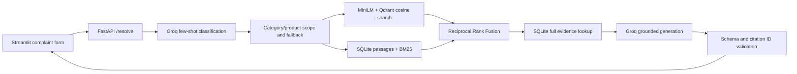

# Telecom Support Resolution Assistant

A query-only support-agent prototype: few-shot complaint classification, metadata-scoped
semantic/BM25 retrieval, rank fusion, and evidence-grounded resolution drafting with citations.
Synthetic tickets and a text-based PDF knowledge base provide the evidence.

## Architecture



## Run on Windows

From the project root, with `.venv` activated:

```powershell
python -m pip install -r requirements.txt
python scripts/prepare_classification_examples.py
python -m pytest tests -q
python -m uvicorn telecom_support.api:app --app-dir src --host 127.0.0.1 --port 8000
```

The API requires an existing active index from `scripts/build_index.py`, enriched KB
records from `scripts/classify_kb.py`, and a local `.env` containing `GROQ_API_KEY`
and optionally `GROQ_MODEL` (default `openai/gpt-oss-20b`). Do not commit `.env`.
Restart the API after changing the active build, examples, or taxonomy.

In a second terminal, activate the same environment and run:

```powershell
python -m streamlit run app.py --server.address 127.0.0.1
```

Open http://localhost:8501. API readiness: http://127.0.0.1:8000/health.
Interactive API documentation: http://127.0.0.1:8000/docs.
Ctrl+C stops each service. Use one API worker; embedded Qdrant owns its local storage lock.

## Behavior and limits

- Classification examples are selected only from training tickets; evaluation tickets
  are excluded. Examples demonstrate existing single-label categories; multiple labels
  are instructed but have not yet been evaluated. Unknown-class examples are unavailable
  in training, so unknown handling uses taxonomy instructions.
- Semantic and lexical search run independently in the same metadata scope for tickets
  and KB. General KB records with both label lists empty remain searchable.
- Scope broadens from category/product to product-only to global when fewer than three
  distinct sources are available or no semantic candidates pass the threshold.
- `SEMANTIC_THRESHOLD` is a process environment variable (default 0.30). It is experimental,
  not calibrated confidence. Cosine threshold does not apply to BM25. Keyword-only evidence
  can still be returned and is flagged in search diagnostics.
- Fusion combines rankings; a cross-encoder reranker is not implemented yet.
- Each normal resolution makes two Groq calls. If no evidence exists, generation is skipped.
  No automatic retry occurs. A 429 reports retry-after when available. Check free-tier quota
  before repeated demos. Selecting examples, embedding and local tests make no Groq calls.
- Each step must cite an evidence ID. Validation checks IDs and structure, not whether every
  claim is entailed by a passage. Agents must review the draft. UI exposes exact retrieved text.
- Complaints exceeding MiniLM's input limit are rejected with a shortening instruction.
- Embeddings use historical conversation text, which includes agent fixes, and original KB text.
- This is a local prototype: no authentication, cross-encoder, Docker deployment, automated
  incremental updates, comprehensive relevance/grounding evals, or production monitoring yet.
  Bind to localhost; do not expose publicly without completing those controls.
- Generated records, model caches, databases and examples are under ignored `data/indexes/`.
  The SQLite `sources.record_json` column holds full records. Qdrant point IDs match SQL passage IDs.

## Tests

`python -m pytest tests -q` uses temporary records and simulated LLM calls; it verifies
contracts, holdout exclusion, source links, scope fallback, ranking, and citation IDs.
Live model prediction quality is a separate evaluation milestone.
