# Telecom Support Resolution Assistant

A support-agent workspace that converts raw telecom complaints into classification, suggested resolution steps, information to ask, and supporting citations. It combines historical tickets and knowledge-base PDFs through semantic and keyword retrieval.

**Status:** working local prototype with tested knowledge updates, evaluations and monitoring. Docker configuration is provided; container build/runtime verification remains pending. Suggested actions require agent review; production readiness is not claimed.

## Contents

- [Problem and scope](#problem-and-scope)
- [Dataset](#dataset)
- [Overall architecture](#overall-architecture)
- [Initial preparation](#initial-preparation)
- [Classification](#classification)
- [Retrieval](#retrieval)
- [Storage](#storage)
- [Generation](#generation)
- [New conversations](#new-conversations)
- [New PDFs](#new-pdfs)
- [New categories and products](#new-categories-and-products)
- [PDF replacement](#pdf-replacement)
- [Caching and decisions](#caching-and-decisions)
- [Evaluation](#evaluation)
- [Monitoring](#monitoring)
- [Setup and execution](#setup-and-execution)
- [Demo](#demo)
- [Production improvements](#production-improvements)
- [Deliverables](#deliverables)
- [Folder structure](#folder-structure)

## Problem and scope

Keyword searches can miss complaints describing the same problem in different words. This assistant finds relevant evidence and drafts actions for a telecom support agent. It is a resolution workspace rather than a conversational chatbot.

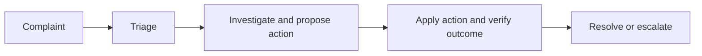

**Input:** customer-reported problem.  
**Output:** verified outcome or escalation in a real support workflow. The prototype drafts actions and stores reviewed records; it does not perform fixes or confirm customer outcomes.

| Scope | Examples |
|---|---|
| Broadband | Drops, slow speed, outages, gateway hardware |
| Mobile | Signal/voice, SIM activation/replacement, porting |
| Commercial/account | Billing, plans, login/identity |
| Field service | Installation and technician visits |
| Extension | Agent-controlled labels; international roaming is currently registered |
| Severity | Low, Medium, High: impact rather than tone |
| Sentiment | Neutral, Frustrated, Angry |

The benchmark covers ten original categories and four products; added classes are not evaluated by those scores. `config/taxonomy.json` contains definitions. The active snapshot's taxonomy is authoritative on restart.

## Dataset

| Source | Role |
|---|---|
| `data/processed/conversations.xlsx` | 200 synthetic tickets: 160 training/reference and 40 held-out |
| `data/knowledge_base/*.pdf` | Text-based telecom procedures |
| `dataset_creation/covered_evaluation_scenarios.json` | Covered test scenarios linked to training procedures |
| `data/evaluation/rag_reference_cases.jsonl` | Source-checked reference resolutions |

Tickets preserve ID, timestamp, category/product, severity/sentiment, complaint, conversation, resolution steps/summary and split. Only training tickets enter retrieval and few-shot prompts. **Conversation text**, including agent turns, is embedded; resolution fields remain generation evidence. KB **original text** is embedded, not predicted titles.

Test cases are synthetic paraphrases of supported problems, four per original category. This is not an independent unseen-problem benchmark. Source-consistency checks are not human approval. Synthetic labels/procedures may be incomplete; reviewed generated additions are not independent evidence of successful fixes.

## Overall architecture

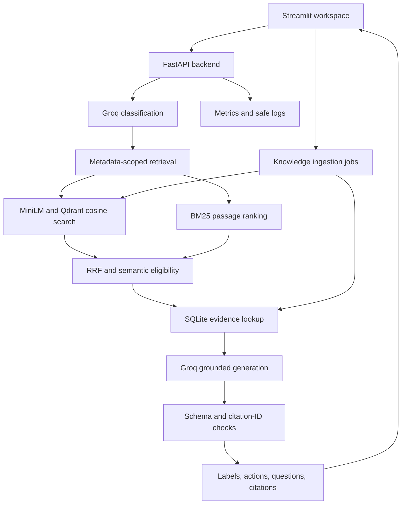

**Input:** raw complaint or approved knowledge submission.  
**Output:** suggested resolution or completed ingestion with searchable knowledge.  
**Files:** `app.py`, `src/telecom_support/api.py`, `pipeline.py`, `ingestion/additions.py`, `monitoring.py`.

Streamlit and FastAPI are the UI/backend service boundary. Classification/retrieval/generation/ingestion are backend modules, not separately deployed microservices. Groq inference is hosted; embeddings/storage are local.

## Initial preparation

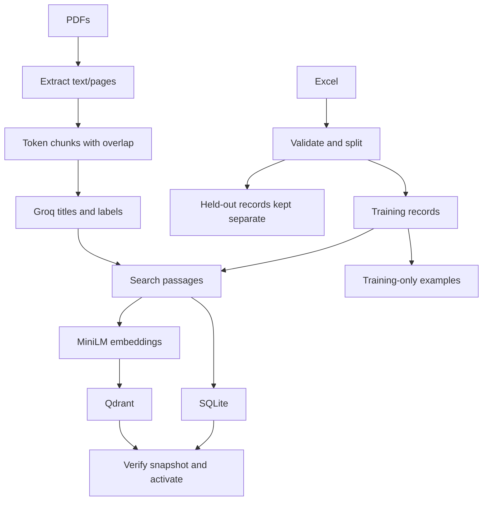

**Input:** workbook and text PDFs.  
**Output:** JSONL records, examples and verified SQLite/Qdrant snapshot. Held-out tickets remain excluded.  
**Files:** `scripts/prepare_sources.py`, `classify_kb.py`, `prepare_classification_examples.py`, `build_index.py`; `ingestion/`, `indexing/`.

Chunks allow **240 tokens including special tokens**, with up to **32 tokens overlap**. MiniLM's configured sequence limit is 256. Blocks/sentences are preferred; oversized sentences can split at tokenizer offsets. Overlap is bounded, not guaranteed at every boundary. Chunks can mix procedures. OCR is not implemented. Titles/labels are predicted from chunk text rather than PDF-specific heading rules.

## Classification

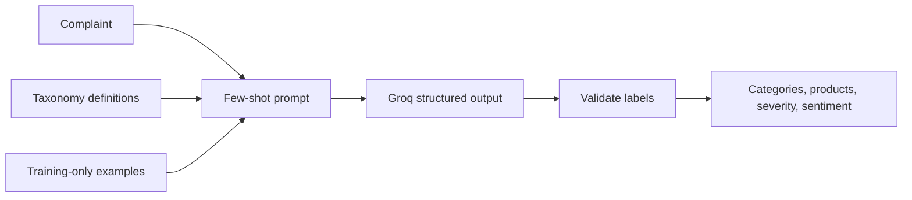

**Input:** complaint, taxonomy and training-only examples.  
**Output:** validated category/product lists, severity and sentiment.  
**Files:** `classification/service.py`, `classification/schemas.py`, `taxonomy.py`, `llm.py` under `src/telecom_support/`.

Few-shot prompting demonstrates classification without training model weights. New classes initially use definitions rather than fabricated examples. Multi-label complaint outputs are supported; the benchmark mainly tests single-label cases. Ticket saving accepts one category/product per record.

## Retrieval

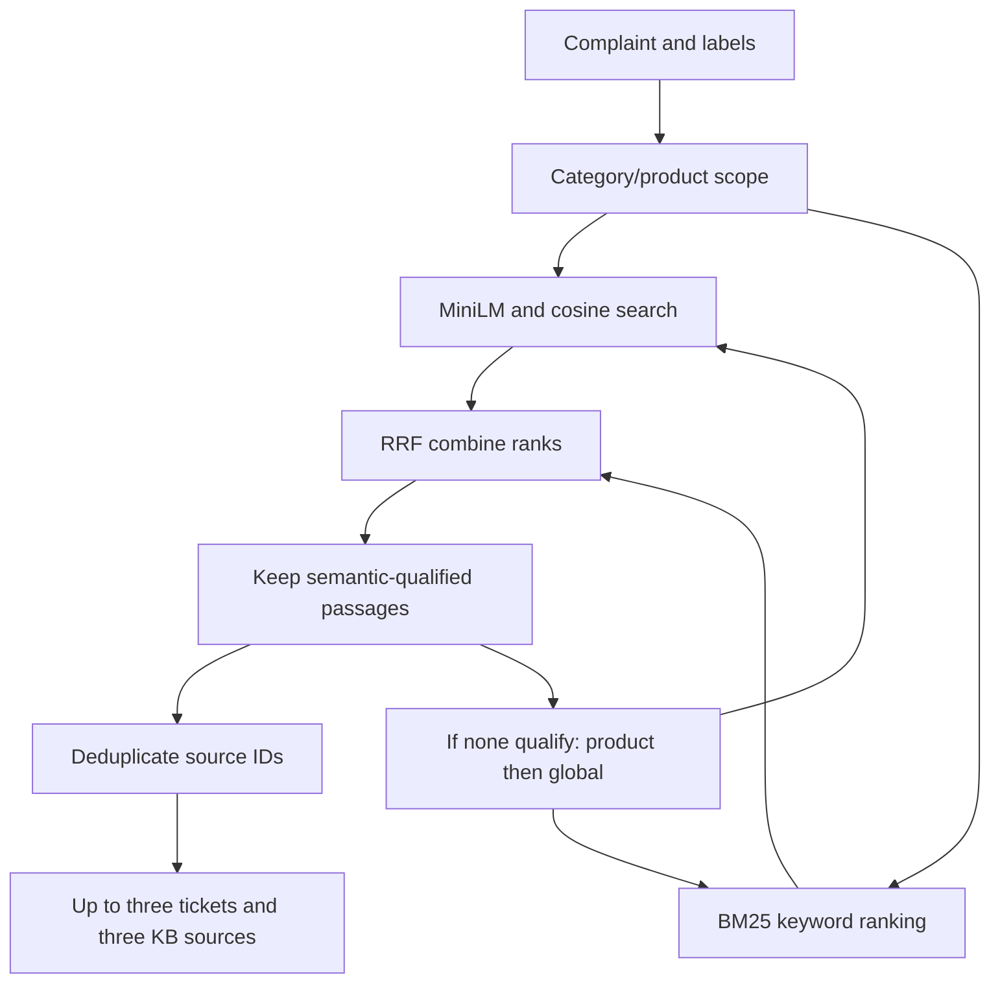

**Input:** complaint, labels, indexed passages and threshold.  
**Output:** up to six evidence sources and internal diagnostics; fewer/no sources are possible.  
**Files:** `retrieval/service.py`, `semantic.py`, `keyword.py`, `ranking.py`, `index.py`.

| Concept | Behavior |
|---|---|
| Cosine | Vector-direction similarity, not correctness probability |
| BM25 | Keyword relevance using rarity, repetition and document length |
| RRF | Adds `1 / (60 + rank)` across lists; rank positions rather than raw scores |
| Semantic gate | Default cosine threshold **0.30**; keyword-only passages do not enter generation |
| Fallback | Search each source type separately; keep narrowest scope with qualifying evidence |
| Source cap | Three per type is a maximum, not a quota |

BM25 still contributes ordering. General KB chunks with empty label lists remain searchable in restricted scopes. The threshold is experimental and can exclude useful exact-term matches. Similarity does not prove applicability. RRF is fusion, not a cross-encoder reranker. Technical diagnostics remain in the API rather than normal UI warnings.

## Storage

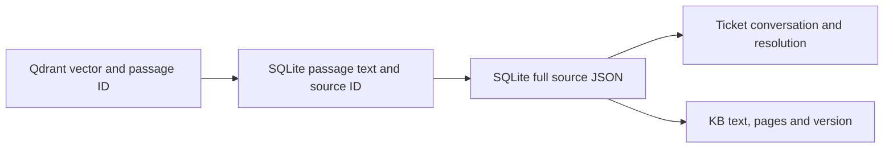

**Input:** selected passage IDs.  
**Output:** passage text and complete source records for generation/citations.  
**Files:** `indexing/storage.py`, `indexing/vectors.py`, `retrieval/index.py`.

| Store | Contents |
|---|---|
| SQLite `sources` | Full `record_json`, type/file/version |
| SQLite `passages` | Text, tokens, labels and source foreign key |
| SQLite `build_metadata` | Manifest |
| Qdrant `support_passages` | Normalised 384-dimensional vectors; IDs match SQL passage IDs |

A long ticket can have multiple passages pointing to one source. A prepared KB chunk is itself a source and normally supplies one passage. `data/indexes/search/active.json` selects a snapshot under `search/builds/`.

## Generation

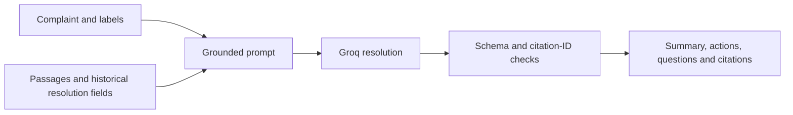

**Input:** complaint, labels and evidence including historical resolution steps.  
**Output:** suggested resolution or insufficient-evidence response.  
**Files:** `generation/service.py`, `generation/schemas.py`, `generation/validation.py`, `pipeline.py`.

Normal requests use two distinct LLM calls/prompts. No-evidence cases skip generation. The prompt preserves diagnostic prerequisites and treats historical diagnoses as precedents. Validation checks IDs/structure, not full entailment. Agents review source text; omitted/blended steps remain possible.

## New conversations


**Input:** complaint, reused classification and approved response.  
**Output:** stored `T-####` ticket, searchable embeddings and completed job.  
**Files:** `app.py`, `ingestion/additions.py`, `indexing/records.py`, `indexing/storage.py`.

The complaint/reviewed response form the conversation. Full original output is retained in `generated_response`; reviewed steps/summary remain standard fields. Existing/held-out IDs are reserved. Supplied labels avoid another classification call. `origin=agent_reviewed_generated` denotes review, not confirmed resolution. Feedback contamination is a known risk.

## New PDFs


**Input:** text PDF up to 10 MB using existing labels.  
**Output:** searchable chunks/metadata/vectors and completed job status.  
**Files:** `ingestion/pdf.py`, `chunking.py`, `metadata.py`, `additions.py`, `api.py`.

HTTP 202 means accepted, not indexed. Automatic UI polling shows completion/failure. New metadata calls are paced 60 seconds apart. Closing the UI does not stop backend work; graceful shutdown waits for it. Duplicate knowledge is rejected. Additions under `data/indexes/additions/` are preserved/replayed by CLI builds. Hard interruptions require recovery/resubmission.

## New categories and products

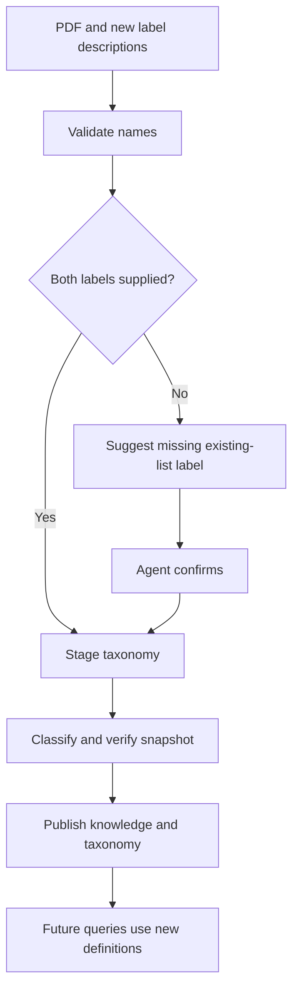

**Input:** PDF and one/both labels, with descriptions for new names.  
**Output:** published expanded taxonomy/knowledge or awaiting-confirmation/failed job.  
**Files:** `ingestion/pdf_labels.py`, `ingestion/additions.py`, `taxonomy.py`.

Both supplied labels skip suggestion. A missing label must be supported by an existing-list match and confirmed; otherwise resubmit with both. Proposed labels remain isolated until success. This is additive registration, not automatic discovery. Old chunks are not automatically relabelled. Refresh examples before evaluation after taxonomy changes.

## PDF replacement

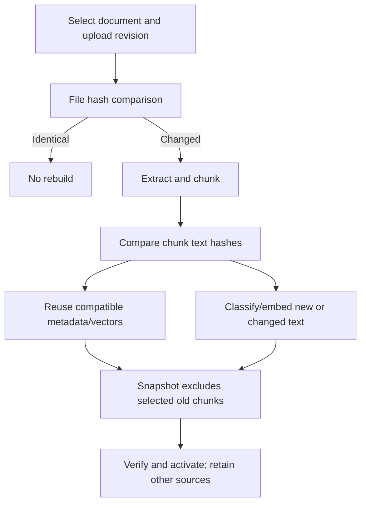

**Input:** existing logical document ID and replacement PDF.  
**Output:** identical-file no-op or updated snapshot with refreshed text/pages/version.  
**Files:** `ingestion/additions.py`, `ingestion/chunking.py`, `indexing/reuse.py`.

SHA-256 detects exact content, not meaning. Chunk matching spans the document, not positions. Formatting/boundary changes may require new work. Metadata reuse requires compatible taxonomy/prompt/model. Retained vectors are copied into a fresh snapshot, not patched in place. Logical document IDs stay stable, raw versions archived, other sources retained. Failures preserve the previous active snapshot; crash-safe publication needs hardening.

## Caching and decisions

| Reuse | Benefit | Limitation |
|---|---|---|
| Metadata cache | Avoid compatible repeated Groq calls | Text/prompt/model/taxonomy changes invalidate reuse |
| Local model cache | Avoid repeated downloads | First setup downloads weights |
| Exact-text vectors | Avoid recomputing unchanged embeddings | Copies vectors into a new store |
| Evaluation resume | Reuse compatible successes | Changed identity starts another run |

Caching reduces work, not quota guarantees. There is no general complaint-answer cache.

| Decision | Reason | Tradeoff |
|---|---|---|
| Few-shot LLM classifier | Limited labelled data and flexible taxonomy | API dependence/variability |
| Local MiniLM | Small CPU model, no embedding API fee | Input length/domain limits |
| BM25 and semantic/RRF | Exact terms plus meaning | Gate may exclude keyword-only matches |
| SQLite/embedded Qdrant | Simple local evidence/vector links | Single worker/storage ownership |
| Verified snapshots | Avoid incomplete activation | Storage copying/retention |
| Reviewed draft ingestion | Convenient knowledge addition | Review is not verified customer outcome |

## Evaluation

Submission evidence is committed under [`data/evaluation/results/`](data/evaluation/results/):
[classification report](data/evaluation/results/classification_report.json),
[RAG report](data/evaluation/results/rag_report.json), and their run manifests.
These preserve evaluated-version provenance; they are not automatically refreshed when the application changes.

### Classification

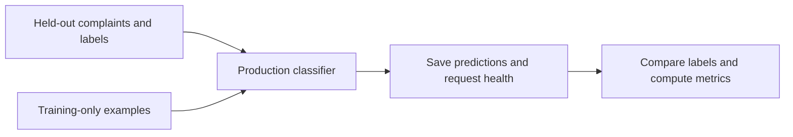

**Input:** 40 held-out synthetic complaints/labels and training-only examples.  
**Output:** predictions, manifest, accuracy/F1 and request-health report.  
**Files:** `scripts/evaluate_classification.py`, `evaluation/classification.py`.

Run `classification-openai-gpt-oss-20b-a9a34c9b` belongs to its recorded taxonomy/prompt/examples, not added classes.

| Metric | Result |
|---|---:|
| Category accuracy | 95.0% |
| Product accuracy | 97.5% |
| Severity accuracy | 90.0% |
| Sentiment accuracy | 90.0% |
| All fields correct | 75.0% |
| Category macro F1 | 0.9492 |
| Successful calls | 40/40 |
| Average successful call time | 0.901 seconds |

### RAG

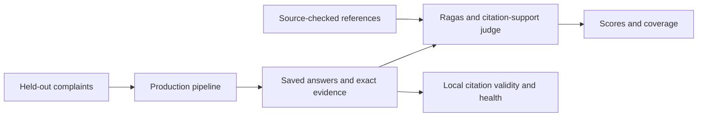

**Input:** selected complaints, saved answers/evidence and source-checked references.  
**Output:** quality estimates, citation checks, scored-case counts/errors/timing.  
**Files:** `scripts/prepare_rag_evaluation.py`, `scripts/evaluate_rag.py`, `evaluation/rag.py`, `evaluation/ragas_adapter.py`.

Run `rag-evaluation-openai-gpt-oss-20b-89e988f2`, inspected 6 October 2026: all metrics completed for five cases; no reported evaluation/pipeline errors.

| Metric | Meaning | Average / cases |
|---|---|---:|
| Context precision | Retrieved context usefulness/order | 0.7131 / 5 |
| Context recall | Reference information coverage | 0.7667 / 5 |
| Faithfulness | Claims supported by evidence | 0.7363 / 5 |
| Answer relevance | Addresses complaint | 0.7847 / 5 |
| Answer correctness | Agreement with reference meaning/facts | 0.6016 / 5 |
| Citation support | Instructions supported by cited sources | 0.8433 / 5 |
| Citation validity | IDs exist in evidence | 1.0000 / 5 |

Request success: **5/5**; no cases without usable evidence. Average end-to-end time: **2.345 seconds**; reported 95th percentile: **2.849 seconds**. Five cases cannot establish stable population percentiles/general quality.

Scores are preliminary LLM judgments, not human approval. Correctness/faithfulness expose gaps. Citation validity alone does not prove sound actions. Meaning is judged rather than exact wording; shared model/provider can introduce correlated errors. Evaluation embeddings pool bounded long-text parts; the judge receives full text. Failed/undefined scores remain null with coverage exposed. Timing excludes startup, pacing and judges.

Latest tests: **70 passed**, five dependency deprecation warnings. Fixtures/simulated LLM calls cover contracts, holdout exclusion, retrieval, citations, storage links, ingestion, taxonomy, replacement/reuse and monitoring. Manual checks covered broadband/mobile/billing/account answers and all update flows; these are functional checks, not independent expert quality approval.

Stop API/UI before evaluation to release embedded Qdrant's storage lock:

```powershell
python -m pip install -r requirements-evaluation.txt
python scripts/prepare_classification_examples.py
python scripts/prepare_rag_evaluation.py
python scripts/evaluate_classification.py --delay 60
python scripts/evaluate_rag.py --stage answers --limit 5 --delay 60
python scripts/evaluate_rag.py --stage scores --limit 5 --delay 60
python scripts/evaluate_rag.py --stage report --limit 5
```

Several paced calls may be needed per metric. Delay does not guarantee quota availability. Compatible successes resume; failures save progress and stop. Code/index/taxonomy/examples/reference changes can create new runs. Reference preparation refuses silent overwrites of changed tickets: review deliberate changes first. `--allow-draft` means exploratory scoring, not approval. Generated reports under `data/indexes/evaluations/` are ignored; these tables preserve the results snapshot.

## Monitoring

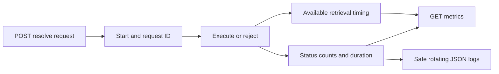

**Input:** resolve requests, status and available timings.  
**Output:** counters/averages, `X-Request-ID` header and logs.  
**Files:** `monitoring.py`, `api.py`, `tests/test_monitoring.py`.

`/health` is basic readiness, not active dependency probing. `/metrics` includes success/failure/no-evidence/status counts and average response/retrieval time. Response timing includes failures; retrieval averages cover completed pipelines with timing, with sample counts exposed. Insufficient evidence may be HTTP success. Counters reset on restart. Logs exclude complaints, output, exception messages and keys; files rotate at approximately 1 MB with three backups. Ingestion metrics, durable aggregation and automatic alerts are not implemented.

```powershell
Invoke-RestMethod http://127.0.0.1:8000/metrics
Get-Content logs/resolution_requests.jsonl -Tail 5
```

## Setup and execution

Python 3.12 was verified. Groq key/model access is required; hosted calls/first-time model downloads need network access. Never commit secrets. From the repository root:

```powershell
python -m venv .venv
.\.venv\Scripts\Activate.ps1
python -m pip install -r requirements.txt
Copy-Item .env.example .env
```

Skip copying if `.env` exists. Set `GROQ_API_KEY` privately; model defaults to `openai/gpt-oss-20b`. Process variables take precedence; restart after key changes. `SEMANTIC_THRESHOLD` is a process variable, default 0.30.

Fresh checkouts must generate ignored indexes:

```powershell
python scripts/prepare_sources.py
python scripts/classify_kb.py --delay 60
python scripts/prepare_classification_examples.py
python scripts/build_index.py
python scripts/check_llm.py
```

Preparation makes no LLM calls; metadata classification calls Groq for uncached chunks; indexing embeds locally; smoke check makes one request. Existing working installations need not rebuild. Back up additions with snapshots.

Terminal 1:

```powershell
python -m uvicorn telecom_support.api:app --app-dir src --host 127.0.0.1 --port 8000
```

Terminal 2, same environment:

```powershell
python -m streamlit run app.py --server.address 127.0.0.1
```

Open `http://localhost:8501`; API docs: `http://127.0.0.1:8000/docs`. Use **one worker**. Models/clients load once at startup. Ctrl+C stops each service; graceful shutdown waits for ingestion. Stop backend before CLI indexing/evaluation. For full tests install optional evaluation dependencies, then `python -m pytest tests -q`.

| Endpoint | Input | Output |
|---|---|---|
| `POST /resolve` | JSON with only `complaint` | Labels, resolution, sources, diagnostics, timings |
| `GET /health` | None | Readiness |
| `GET /metrics` | None | Counters/averages |
| `GET /taxonomy` | None | Definitions |
| `POST /ingestion/conversations` | Reviewed record JSON | Accepted job |
| `POST /ingestion/pdfs` | Binary PDF and label/replacement parameters | Accepted job |
| `GET /ingestion/documents` | None | Document choices |
| `GET /ingestion/jobs/{job_id}` | Job ID | Progress/result |
| `POST /ingestion/jobs/{job_id}/confirm-labels` | Paused job ID | Continue ingestion |

Example request:

```json
{"complaint": "My broadband drops every evening and restarting the router has not helped."}
```

Output keys: `classification`, `resolution` (summary, cited steps, missing information, escalation), `sources`, `retrieval`, `timings_seconds`. Extra fields are rejected. A 6,000-character HTTP limit plus embedding token limit applies. Input validation uses 422, busy processing 503, handled service errors currently 400, unexpected failures 500. Provider-status mapping/unrelated-question handling need improvement.

### Docker deployment

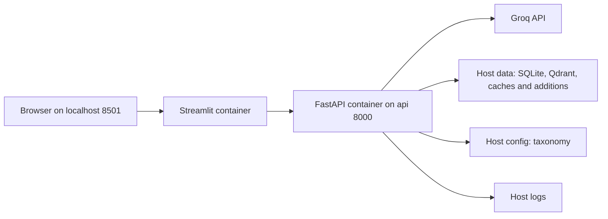

**Input:** complaint/upload requests, runtime Groq credentials and prepared host data.  
**Output:** two container services, responses and persistent knowledge/logs.  
**Files:** `Dockerfile`, `compose.yaml`, `.dockerignore`.

Docker Desktop must run Linux containers. Stop native API/UI and evaluation processes first; only one process can own the local Qdrant index. The compose configuration reuses your existing `data/` and `config/`; a fresh checkout still needs the preparation steps above, or the container preparation commands below. Secrets/data are excluded from image layers. Compose reads your local `.env` and gives the key only to the API. Do not share expanded `docker compose config` output because it can contain credentials; use `config --quiet` for validation.

```powershell
docker compose config --quiet
docker compose up --build -d
docker compose ps
Invoke-RestMethod http://127.0.0.1:8000/health
Invoke-RestMethod http://127.0.0.1:8000/metrics
docker compose logs --tail 50 api
```

First build downloads Python/CPU dependencies; startup may download model files if not cached. UI waits for API health. Ports bind only to localhost. Both images run as a non-root user; Linux host mount directories must be writable by UID 10001 (Windows Docker Desktop handles mounts differently). No automatic metadata requests or index rebuild happen on service startup.

For preparation entirely inside Docker on a fresh checkout, build images then run commands one at a time **before** `up`:

```powershell
docker compose build
docker compose run --rm --no-deps api python scripts/prepare_sources.py
docker compose run --rm --no-deps api python scripts/classify_kb.py --delay 60
docker compose run --rm --no-deps api python scripts/prepare_classification_examples.py
docker compose run --rm --no-deps api python scripts/build_index.py
docker compose up -d
```

Do not repeat preparation for an existing working index. Before stopping during PDF ingestion, wait for completion; the 15-minute grace period is finite and long jobs may still be interrupted.

```powershell
docker compose stop
docker compose start
# Remove containers/network, keeping host-mounted data:
docker compose down
```

Verify one complaint, an uploaded source and `/metrics`, then restart containers and confirm knowledge remains searchable. Metrics counters reset on API restart; host files remain. **Verification status:** configuration added; actual image build, startup and persistence check not yet confirmed.

## Demo

1. Start services; check `/health`.
2. Submit a broadband complaint and review steps/citations.
3. Try: “My phone's 4G internet works normally, but incoming calls go straight to voicemail and outgoing calls fail immediately. What should I do?” Check applicable voice-provisioning evidence; wording varies.
4. Review/save a single-category answer and note its ticket ID.
5. Upload a short text PDF, wait for completion and query covered content.
6. Replace it; verify changed content and other retained sources.
7. Show new-label registration/confirmation.
8. Inspect `/metrics` and evaluation results with sample counts.

Use only synthetic/public or approved data for hosted processing. Suggested actions are not executed fixes.

## Production improvements

| Current implementation | Future production improvement |
|---|---|
| Single-worker local backend | External Qdrant/database, stateless API scaling |
| In-process ingestion | Durable queue/workers and idempotent recovery |
| Local administration | Authentication, upload permissions and audit trails |
| No automatic provider retry | Bounded backoff, timeouts and circuit breakers |
| Process-local monitoring | Durable dashboards, alerts and privacy-aware tracing |
| Text PDFs | OCR/layout parsing and procedure review |
| RRF/experimental gate | Threshold tests, reranking and procedure-specific selection |
| Synthetic benchmark | Independent expert cases and judge calibration |
| Reviewed drafts | Verified outcome tracking to prevent error reinforcement |
| Additive labels | Versioned migration/relabeling and reviewed class discovery |
| Retained snapshots | Backup/restore, retention and crash-safe publication |

Implemented exploration: controlled taxonomy extension, PDF replacement, metadata caching, vector reuse, verified activation and evaluation resume. Automatic clustering/cross-encoder reranking/general answer caching remain future scope. Keep services local until security controls exist.

## Deliverables

| Requirement/rubric area | Evidence/status |
|---|---|
| Problem understanding | Scope, ticket lifecycle, dataset limitations |
| Architecture | Overall/component/update diagrams with inputs/outputs |
| Executable GitHub code | Source/setup provided; final push and clean-checkout verification required |
| Semantic retrieval/RAG | Working UI/API, MiniLM/Qdrant, BM25/RRF and citations |
| Evolving data/classes | Ticket/PDF additions, replacement and controlled taxonomy |
| Additional exploration | Hash reuse, staged labels and snapshots |
| Evals/system health | Results, 70 tests, manual checks and metrics/logs |
| Design/production scale | Tradeoffs and future deployment considerations |
| Docker packaging | Configuration provided; build/runtime verification pending |

## Folder structure

```text
app.py                         Streamlit UI
config/taxonomy.json            Label definitions
requirements.txt               Application dependencies
requirements-evaluation.txt    Optional evaluation dependencies
.env.example                   Private-key/model template
scripts/                       Preparation, indexing and evaluation commands
src/telecom_support/
  api.py                       Endpoints and lifecycle
  pipeline.py                  Request orchestration
  llm.py                       Structured Groq client
  taxonomy.py                  Dynamic registry
  monitoring.py                Counters and safe logs
  classification/              Prompts and schemas
  ingestion/                   Excel/PDF preparation and update jobs
  indexing/                    Embeddings, SQLite, Qdrant and reuse
  retrieval/                   Semantic/BM25 search and fusion
  generation/                  Grounded output and citation validation
  evaluation/                  Metrics, adapters and reports
tests/                         Offline behavior/contract checks
dataset_creation/              Synthetic generation and scenarios
data/processed/                Workbook and mapping
data/knowledge_base/           Source PDFs
data/evaluation/               RAG references
data/indexes/                  Generated records/caches/additions/builds/reports (ignored)
logs/                          Operational logs (ignored)
```

Secrets, environments, indexes and logs are excluded by `.gitignore`. This README is the single documentation entry point.
